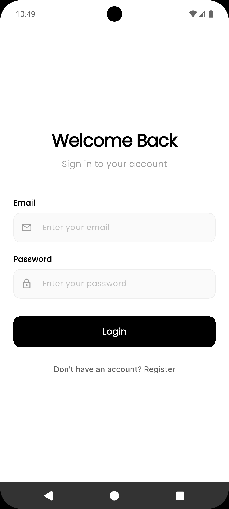
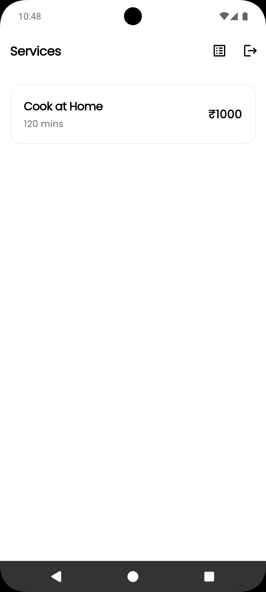
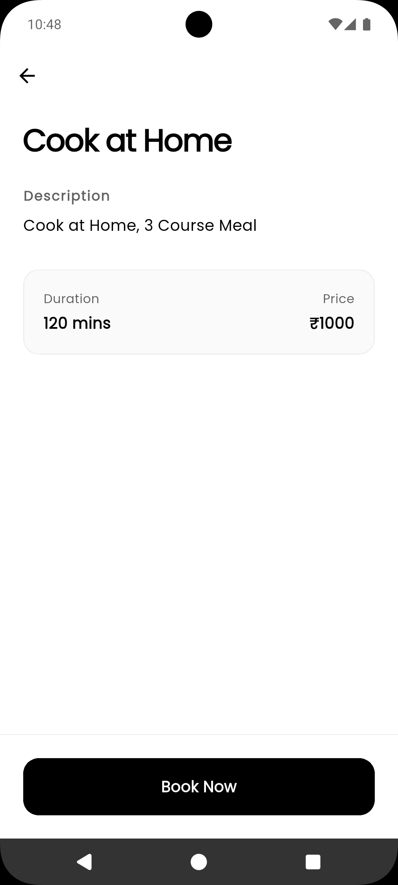
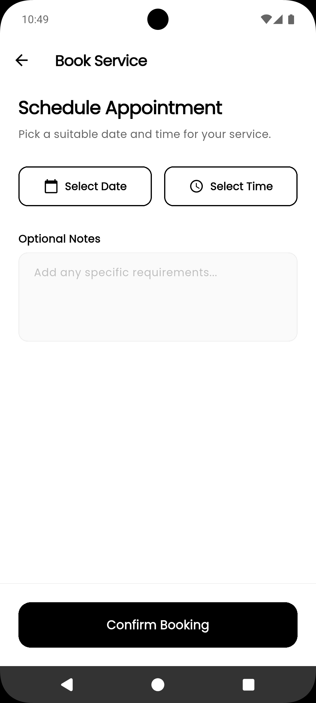
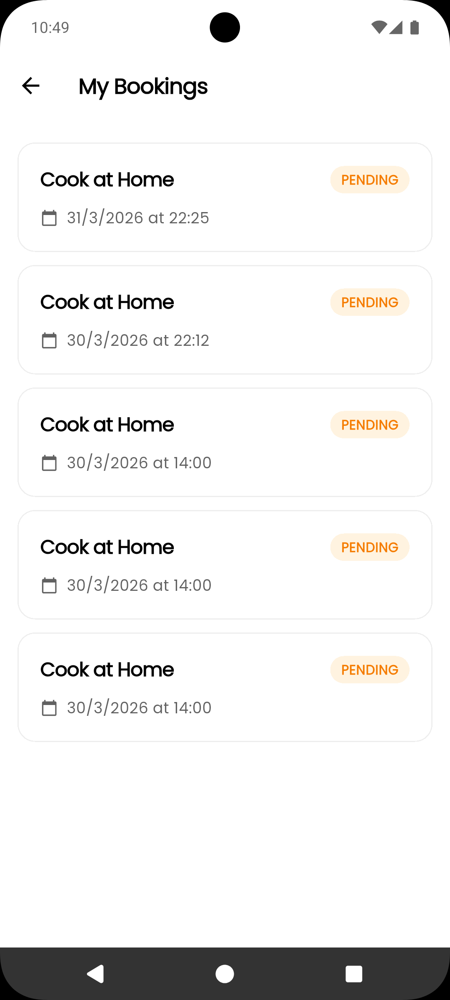

# BookingApp — Service Booking App

Simple Flutter app for browsing services, viewing details, and scheduling appointments.

Quick highlights

- Browse available services with categories
- View service details, pricing, and duration
- Schedule and manage appointments
- Persistent authentication (login/register)
- Offline support via cached responses
- Deep-link support for specific services

Screenshots

Screenshots are in the `screenshots/` folder in the root of the repository (not in assets/images, to avoid increasing APK size):

**Login**



**Services List**



**Service Details**



**Book Appointment**



**My Bookings**



Download APK

[Download latest release APK](https://github.com/TusharSharmaIN/booking_app_mobile/releases)

Quick start

1. Clone the repository
2. Install dependencies:

```
flutter pub get
```

3. Run (dev):

```
flutter run -t lib/main_dev.dart
```

Build (release APK):

```
flutter build apk --release --flavor prod -t lib/main_prod.dart
```

Notes

- Run codegen after model changes:

```
flutter pub run build_runner build --delete-conflicting-outputs
```

- The app uses `flutter_secure_storage` for secure auth token storage and `dio` for API communication.

Features

- Home: available services with search
- Details: service description, price, duration, and booking CTA
- My Bookings: view and track your scheduled appointments
- Authentication: secure login and account registration
- Deep link: open service via URL (e.g. `bookingapp://service/serviceId`)

Architecture

- Layered: presentation -> application (bloc) -> domain -> infrastructure
- Repositories + remote/local data sources
- DI with get_it, routing with go_router
